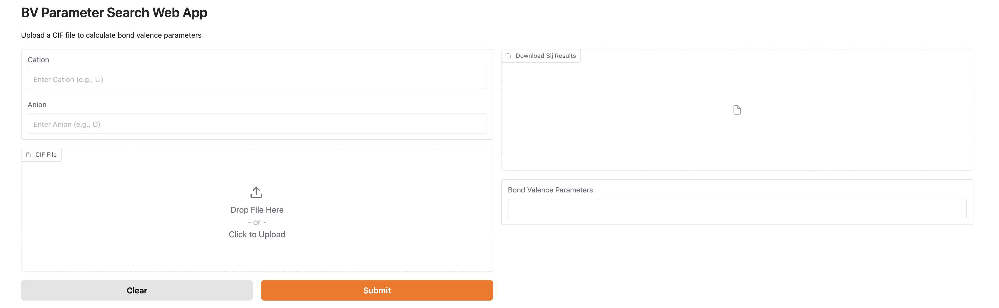

# BondValenceParametersFit
A Python package for fitting bond valence parameters $R_0$ and $B$ for cation-anion pairs using Materials Project data. It includes two modules: (1) computing theoretical bond valence and (2) optimizing parameters by matching computed and empirical values. This tool refines bond valence analysis with a data-driven approach.

## How to fit BV parameters

```python
from bond_valence_processor import BondValenceProcessor

cations = ['Li'] # a list of cation species 
anion = 'O' # anion 
my_api_key = "your_api_key" # api key for materialsproject.org 
algos = ['shgo', 'brute', 'diff', 'dual_annealing', 'direct']
processor = BondValenceProcessor(my_api_key, algos, cations, anion)
    
for cation in cations:
    processor.process_cation_system(cation, anion)   
```

## CLI usage (recommended)

Use `test.py` to run parameter fitting and save results under `./res/<cation><anion>/...`.

```bash
# Option 1: pass the key explicitly
python3 test.py --api-key YOUR_MP_KEY --cations Li Na K --anion O

# Option 2: use an environment variable
export MP_API_KEY=YOUR_MP_KEY
python3 test.py --cations Li,Na,K
```

More examples:

```bash
# Fit using a single Materials Project structure
python3 test.py --cations Li Na --mp-id mp-123

# Generate debug grid Excel (no fitting)
python3 test.py --cations Li --debug

# Constrained fitting (no Sij tweaks)
python3 test.py --cations Li --enforce-constraints

# Constrained fitting with Sij tweaks when needed (implies constraints)
python3 test.py --cations Li --allow-sij-tweaks
```

Flags (one line each):
- `--api-key`: Materials Project API key (or set `MP_API_KEY`).
- `--cations`: One or more cations (space-separated or comma-separated).
- `--cation`: Deprecated alias for `--cations` (repeatable).
- `--anion`: Anion symbol (default: `O`).
- `--mp-id`: Process only one Materials Project material ID (e.g., `mp-123`).
- `--algos`: Optimization algorithms to run (default includes `shgo`, `brute`, `diff`, `dual_annealing`, `direct`).
- `--debug`: Write `debug_grid.xlsx` instead of fitting `R0/B`.
- `--enforce-constraints`: Enforce physical constraints on fitted parameters.
- `--allow-sij-tweaks`: If constraints fail, retry by tweaking `Sij` on the shortest target bond.

## online bond valence parameter fitting web 
An online web interface for fitting bond valence parameters is available at Hugging Face: https://huggingface.co/spaces/nodameCL/BVSearchApp.
Users can upload a single CIF file to calculate the theoretical bond valence (S$_ij$) and obtain fitted bond valence parameters (R$_0$ and B) for target bonds with specified bond types. A snapshot of the interactive web application is displayed below. 
 
